#  1).Ubuntu serverga PostgreSQL ni to'g'ri o'rnatish
#  2).PostgreSQL da Database va User yaratish 
#  3).Serverdagi PostgreSQL ga local Kompyuterimizdan bog'lanish


 <hr>
 
✅ Ubuntu 20.04 yoki undan keyingi versiyalar uchun:
```rb
sudo apt update
sudo apt install postgresql
```

<br>


✅ PostgreSQL ga bog'lanish:
```rb
sudo -i -u postgres
psql
```
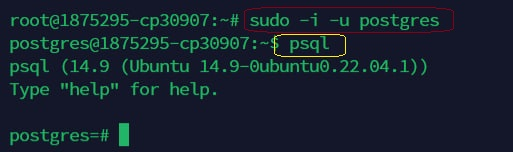

<br>


✅ PostgreSQL da Database va unga User yaratish:
```rb
create database my_db;
create user my_user with password '12345';
```
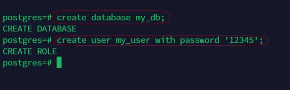

<br>


✅ PostgreSQL dan chiqish:
```rb
\q 
logout
```
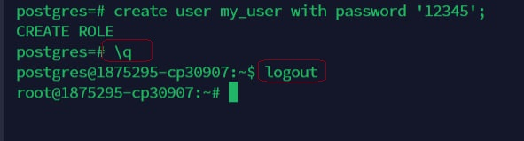

<br>


✅ PostgreSQL ni DJANGO loyihada ishlatmoqchi bo'lsangiz o'rnating:
```rb
# ❌ pip install pyscopg2 buni o'rnatmang
pip install psycopg2-binary
# agar pip da xato bersa
sudo apt install python3-pip
```

<br>


# PostgreSQL ga Local Kompyuterimizdan bog'lanish uchun kerakli dastur:

[DBeaver](https://dbeaver.io/download/)  # Ishlatishda pgAdmindan ancha qulay


<br>


✅ DBeaver dasturini oching va rasmlardagi ketma ketlikda bajaring:

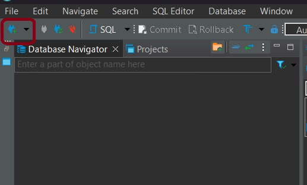

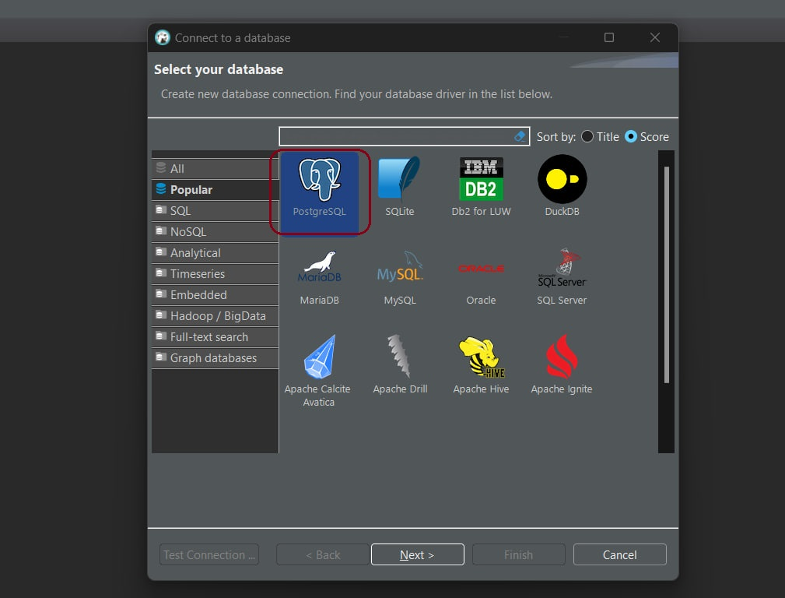


<br>

✅ Belgilangan joylarga ma'lumotlarni kiriting va Test Connection... ni bosing:


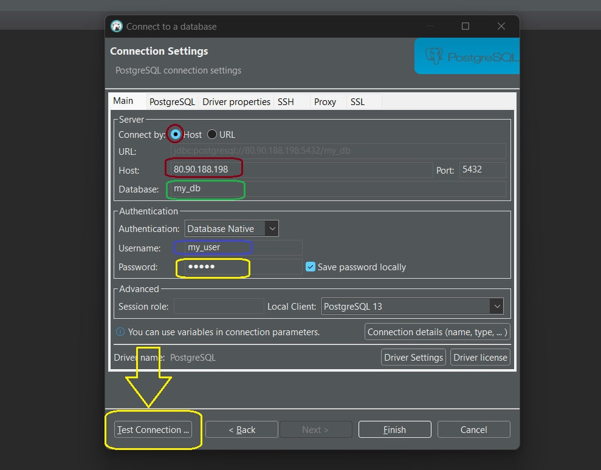


<br>

✅ Ushbu Xatolik chiqishi kerak!:
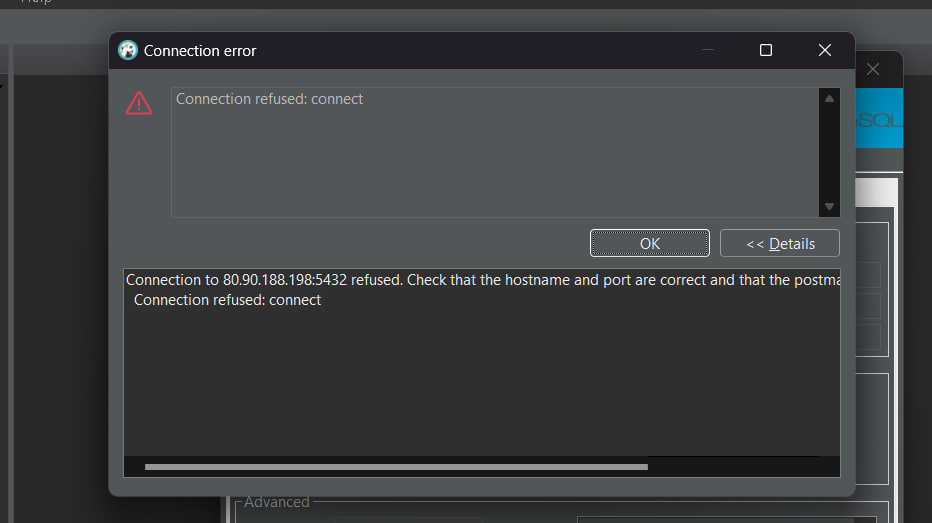


<br>

✅ Yuqoridagi xatolik serverdan ruxsat yuqligi sababli kelib chiqadi sozlash uchun serverdagi PostgreSQL ni sozlamalariga o'zgarishlar kiritamiz!
 - Sizda versiyasi boshqa bo'lishi mumkin!
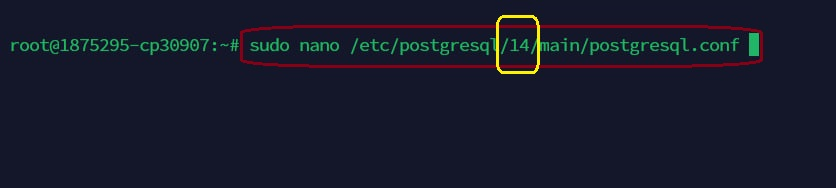


<br>

✅ Rasmdagi qismni fayldan qidiring va ketma ketlikni bajaring!
 - ❗️Faylga yozib bo'lganingizdan so'ng
 - Avvalgi holati
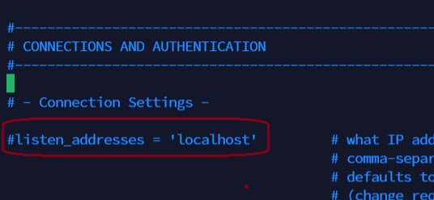


 - O'zgarish
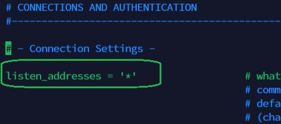

```rb
   ctrl+s
   ctrl+x
   Y
   Enter # ni bosing va faylni saqlab chiqib ketadi
```


<br>


✅ Keyingi fayni sozlang!
 - ❗️Faylga yozib bo'lganingizdan so'ng


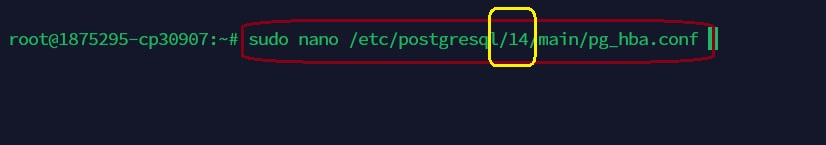

- Avvalgi holati
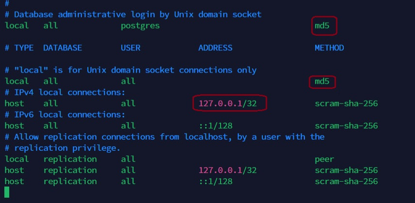

- O'zgarish
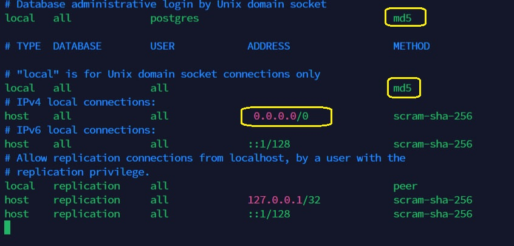

  ```rb
   ctrl+s
   ctrl+x
   Y
   Enter # ni bosing va faylni saqlab chiqib ketadi
  ```


<br>

✅ O'zgarishlarni tugatib DBeaver Test Connection... ni qayta bosing xatolik yuqolishi va rasmdagidek chiqishi kerak:


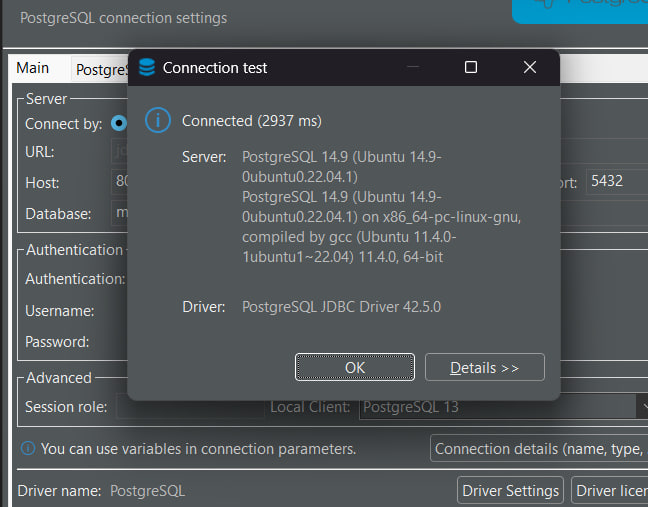

- Finishni bosing bazaga ualansiz bemalol bazani boshqarishingiz mumkin 🥳
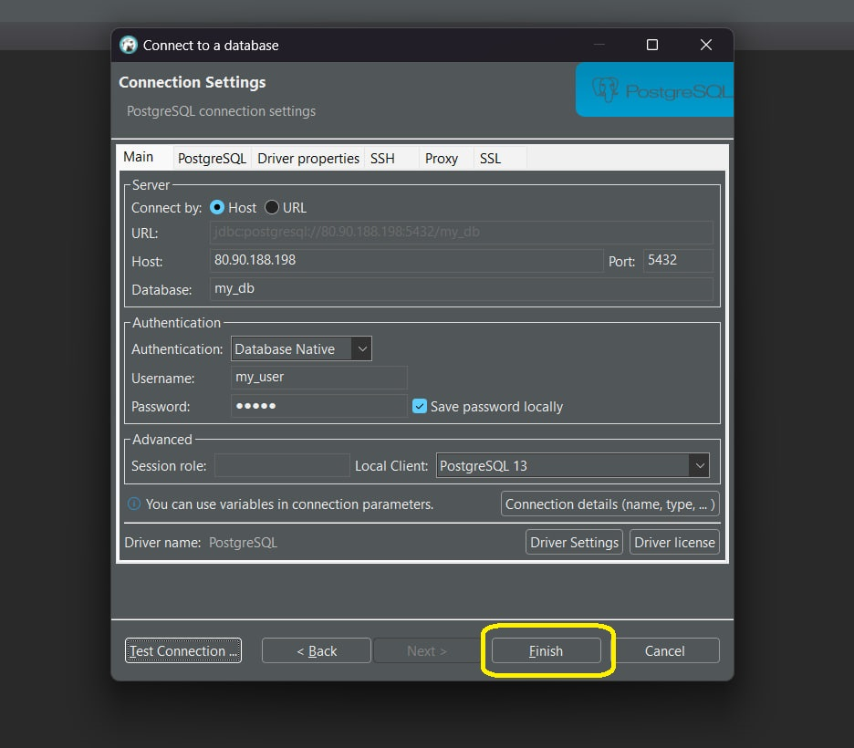


<hr>
 Mehnatimiz sizga foyda berayotgan bolsa GITHUB profilimizga obuna bo'ling va telegram kanalimizda reaksiyalarni qoldiring 👍
 
# *E'tiboringiz uchun rahmat* Savollaringiz bo'lsa [Telegram](https://t.me/foydamizteg_sin)


